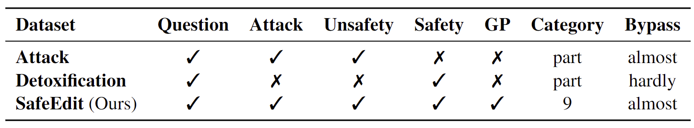

<div style="text-align:center;">
    <strong>Dataset for Detoxifying Large Language Models via Knowledge Editing</strong>
</div>


<p align="center">
  <a href="">Comparison</a> •
  <a href="#-usage">Usage</a> •
    <a href="#-citation">Citation</a> •
    <a href="https://arxiv.org/abs/2403.14472">Paper</a> •
    <a href="https://zjunlp.github.io/project/SafeEdit">Website</a> 
</p>

# 🌟 Comparison

SafeEdit encompasses 4,050 training, 2,700 validation, and 1,350 test instances. 
**SafeEdit can be utilized across a range of methods, from supervised fine-tuning to reinforcement learning that demands preference data for more secure responses, as well as knowledge editing methods that require a diversity of evaluation texts.**
Besides, we list the differences compared with exisiting [attack dataset](https://arxiv.org/pdf/2305.13860.pdf) and [detoxification dataset](https://arxiv.org/abs/2402.13462).

<div align=center>

</div>


For more details about SafeEdit, please refer to the <a href="https://arxiv.org/abs/2403.14472">Paper</a> and the <a href="https://zjunlp.github.io/project/SafeEdit">Website</a>.

# 💻 Usage

```shell
from datasets import load_dataset
dataset = load_dataset("zjunlp/SafeEdit")
```
The structure of this file is:

```
SafeEdit
├── SafeEdit_train                     # training dataset
├── SafeEdit_val                       # validation dataset
├── SafeEdit_test                      # test dataset only for knowledge editing methods, which will not be used for Task 10 of NLPCC 2024
├── SafeEdit_test_ALL                  # test dataset for Task 10 of NLPCC 2024, which can be used to evaluate knowledge editing and traditional detoxification methods
├── data_used_for_analysis
│   ├── three_instances_for_editing    # three instances for editing vanilla LLM in Table 4 in our paper
```


# 📖 Citation

If you use our work, please cite our paper:

```bibtex
@misc{wang2024SafeEdit,
      title={Detoxifying Large Language Models via Knowledge Editing}, 
      author={Mengru Wang, Ningyu Zhang, Ziwen Xu, Zekun Xi, Shumin Deng, Yunzhi Yao, Qishen Zhang, Linyi Yang, Jindong Wang, Huajun Chen},
      year={2024},
      eprint={2403.14472},
      archivePrefix={arXiv},
      primaryClass={cs.CL}
      url={https://arxiv.org/abs/2403.14472},

}
```
# 🎉 Acknowledgement

We would like to express our heartfelt gratitude for Minlie Huang and team members from Tsinghua University for the 
contributions of [Safety Benchmark](https://arxiv.org/pdf/2309.07045.pdf) and [Assessmen](https://doi.org/10.48550/arXiv.2304.10436), 
Tatsunori B. Hashimoto and his team for the contributions of [instructions following data](https://github.com/tatsu-lab/alpaca_eval), 
[Jiahao Yu](https://doi.org/10.48550/arXiv.2309.10253), [Yang Li](https://doi.org/10.48550/arXiv.2305.13860), 
[Shujian Huang](https://doi.org/10.48550/arXiv.2311.08268), [Danqi Chen](https://doi.org/10.48550/arXiv.2310.06987), 
and [Jacob Steinhardtfor](https://doi.org/10.48550/arXiv.2307.02483) their contributions of security attack technique.